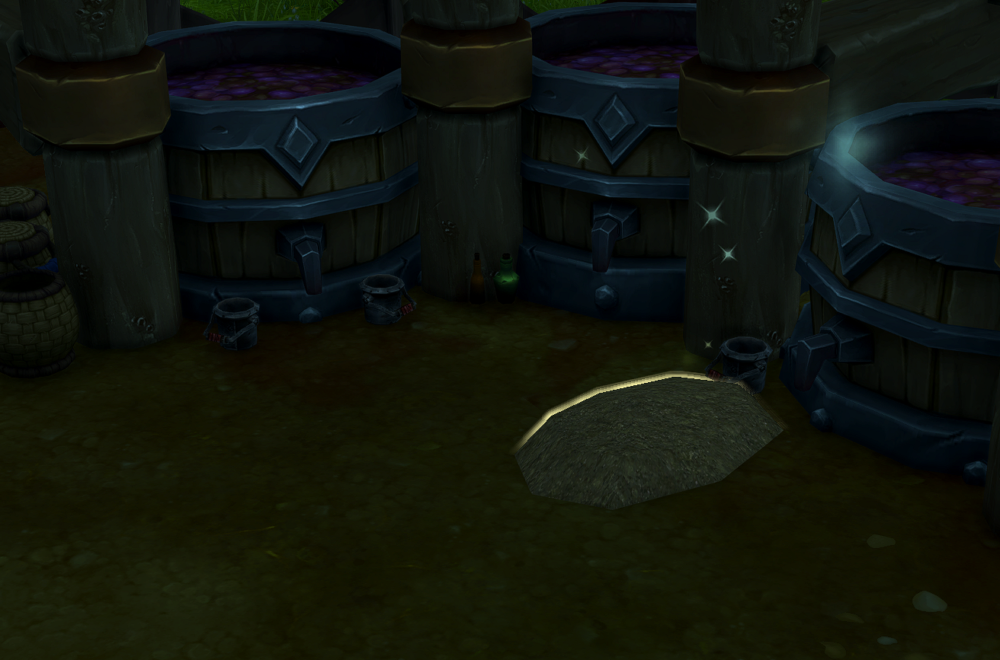

# Decor Treasure Hunt

## Description

**Decor Treasure Hunt** automatically sets waypoints for the daily Decor Treasure Hunt quest, making it easy to find the hidden decoration item on your island.

### Features

- **Automatic Waypoint** - Waypoint is set automatically when you accept the quest
- **Blizzard Map Integration** - Uses the native WoW waypoint system with super tracking
- **TomTom Support** - Optional integration with TomTom for enhanced waypoint functionality
- **Smart Detection** - Automatically detects if you already have the quest active when logging in
- **Fully Localized** - Supports all WoW client languages

### How It Works

1. Accept the "Decor Treasure Hunt" quest on your island
2. A waypoint is automatically created at the treasure location
3. Follow the waypoint on your map and minimap to find the decoration
4. The waypoint is automatically removed when you complete or abandon the quest

### Perfect For

Players who want to efficiently complete their **daily decoration grind** across **multiple characters** without searching the entire island or consulting external guides every single day!

---

Maximize your housing decoration collection with minimal effort!

## Installation

1. Download from CurseForge
2. Extract to `World of Warcraft\_retail_\Interface\AddOns\`
3. Restart WoW or reload UI (`/reload`)

## License

Copyright © 2025 Selina Ruesch. All rights reserved.